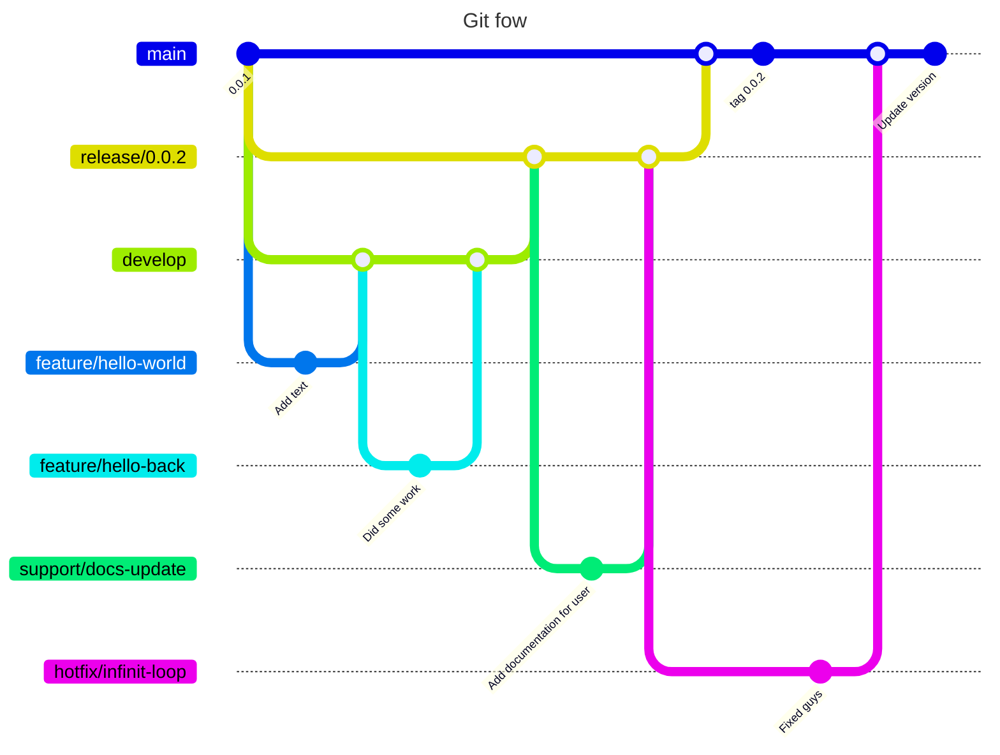

[](https://gitlab.com/DTM-Henallux/MASI/etudiants/sermeus-steven/template-hono-nextjs/-/commits/main)
[](https://gitlab.com/DTM-Henallux/MASI/etudiants/sermeus-steven/template-hono-nextjs/-/commits/main)

# Hono NextJS Template

This is a template for a NextJS project with Hono, with basic authentication with password and JWT.

## Features

- [x] OpenAPI 3.0
  - [x] Swagger UI / Scalar UI (/api/ui | /api/scalar)
- [x] JWT Authentication
  - [x] Password
  - [x] Refresh Token
  - [x] HTTP Only Cookie
- [x] Prisma ORM
  - [x] PostgreSQL
- [x] Hono RPC Client
- [x] API Integration tests with vitest
  - [x] Uses of testcontainers for the database
  - [x] Hono test client for the API
- [x] Environment Variables validation with [t3-env](https://github.com/t3-oss/t3-env)
- [x] Gitlab CI/CD
  - [x] Lint
  - [x] Test
  - [x] Build
- [x] Versioning for API
- [x] In memory rate limiter

## Getting Started

### Prerequisites

- Node.js
- Yarn
- Docker
- Docker Compose

### Installation

1. Clone the repository

```bash
git clone git@github.com/StevenSermeus/hono-next-rpc-openapi.git
```

2. Install dependencies

```bash
yarn
```

3. Start the development database

```bash
cd docker
docker-compose up -d
cd ..
```

4. Push Prisma schema to the database

```bash
yarn prisma db push
```

5. Start the development server

```bash
yarn dev
```

### File Structure

```bash
.
├── docker
├── prisma
└── src
    ├── app
    │   ├── _api
    │   ├── _components
    │   │   ├── magicui
    │   │   └── ui
    │   ├── _lib
    │   ├── _providers
    │   ├── api
    │   │   └── [[...route]]
    │   ├── fonts
    │   ├── redirect
    │   └── utils
    ├── backend
    │   ├── config
    │   ├── libs
    │   ├── middleware
    │   ├── routes
    │   │   ├── auth
    │   │   └── health
    │   └── variables
    └── tests
```

- `docker`: Docker configuration files
- `prisma`: Prisma configuration files
- `src/app`: NextJS application
  - `src/app/_api`: API routes (It imports the hono app from the backend folder)
- `src/backend`: Hono backend
  - `src/backend/routes`: API routes
- `src/tests`: Integration tests

### Run the tests

```bash
yarn test
```

### Pre-commit

You can use the pre-commit hook to run the tests before committing. This pre-commit hook is managed by husky and will run the format, lint and test scripts before committing.

```bash
yarn pre-commit:install
```

### Hono

Here is a list of the relative documentation for Hono:

- [RPC](https://hono.dev/docs/guides/rpc#client)
- [ZodOpenAPI](https://hono.dev/examples/zod-openapi)
- [Swagger UI](https://hono.dev/examples/swagger-ui)
- [Routing & best practices](https://hono.dev/docs/guides/best-practices#don-t-make-controllers-when-possible)

## How the authentication works

### Password

Password are hashed with argon2 before being stored in the database.

### JWT and HTTP Only Cookie

When a user logs in, 2 JWT tokens are generated:

- Access Token: This token is used to authenticate the user for the API. It is stored in the httpOnly cookie and is short-lived (15 minutes).
- Refresh Token: This token is used to generate a new Access Token. It is stored in a httpOnly cookie and is long-lived (7 days) only for the logout and renew token routes.

When the user logs out, the refresh token is invalidated.

The access token can be expired at 2 times:

- Before loading a page.
- When the user tries to access an API route.

#### Before loading a page

A middleware protects the pages that need authentication. If the access token is expired, the user is redirected to the `redirect` page with a search parameter `redirect` containing the current page. The user will call the renew endpoint to get a new access token. If the renew endpoint fails, the user is redirected to the login page. If the renew endpoint is successful, the user is redirected to the page he wanted to access.

#### When the user tries to access an API route

An automatic retry is done when the access token is expired. The user will call the renew endpoint to get a new access token. If the renew endpoint fails, the user is redirected to the login page. If the renew endpoint is successful, the user will retry the API call.

## Further improvements to do

- [ ] Add a support for [Auth.js](https://authjs.dev/getting-started) there is [@hono/auth-js](https://www.npmjs.com/package/@hono/auth-js).

## License

This project is licensed under the MIT License - see the [LICENSE](LICENSE) file for details.

# Code guidelines

## General

- **Use English**: All code, comments, and documentation should be written in English.

- **Use meaningful names**: Use descriptive names for variables, functions, classes, etc. Avoid abbreviations and acronyms.

- **Use comments**: Your coud should be self-explanatory, but if you have to use comments, make sure they are clear and concise. (Because comments can become outdated, prefer self-explanatory code.)

- **Use constants**: Use constants for values that are used multiple times in your code.

- **Use tailwindcss**: Use tailwindcss for styling your components. It will help you to keep your styles consistent and maintainable. If you need specific styles that are not in tailwindcss, you will need to use the inline styles from React.

- **Use TypeScript**: Use TypeScript for your code. It will help you to catch errors before runtime.

# Version control

Here is a global overview of the version control system we are using in the project. Read this document to understand how to contribute but also read the readme of the project to understand the project structure and specific rules to follow by project.

## How to contribute ?

For git we use the git flow workflow. If you are not familiar with it, you can read more about it [here](https://www.atlassian.com/git/tutorials/comparing-workflows/gitflow-workflow). But we aren't using the command line tool, we are doing it manually. (The command line work well for local development but not for a team of developers, you can use it to create your branch but be updated on the state of the remote at the moment your create your branch).



### 1. Create a feature branch

```bash
git checkout develop
git checkout -b feature/your-feature-name
git push origin --set-upstream feature/your-feature-name
```

To merge your feature branch into the develop branch, you need to create a pull request. The pull request will be reviewed by the project manager or a team member.

If your branch is some commit behind the develop branch, you need to rebase your branch on the develop branch.

```bash
git checkout develop
git pull
git checkout feature/your-feature-name
git rebase develop
```

### 2 Create a release branch

When you are ready to release a new version of the app, you need to create a release branch.

```bash
git checkout develop
git checkout -b release/version-number
git push origin --set-upstream release/version-number
yarn version | --major | --minor
```

No new features should be added to the release branch. Only bug fixes and documentation updates are allowed.

### 3. Create a hotfix branch

If a bug is found in the main branch, you need to create a hotfix branch.

```bash
git checkout main
git checkout -b hotfix/bug-name
git push origin --set-upstream hotfix/bug-name
```

Create your pull request and wait for the review. Once the pull request is approved, you can merge it into the main branch. Don't forget to update the version number in the package.json file.

### 4. Create a support branch

If you need to update the documentation or add some documentation, you need to create a support branch.

```bash
git checkout release/version-number
git checkout -b support/docs-update
git push origin --set-upstream support/docs-update
```

Create your pull request and wait for the review. Once the pull request is approved, you can merge it into the release branch.

## How to update version number

To update the version number, you need to run the following command:

```bash
yarn version | --major | --minor | --patch
# or
npm version | major | minor | patch
```

## Clean your self up

After your branch has been merged if the github merge doesn't delete the branch on the remote you can delete it manually.

```bash
git branch -d branch-name
git push origin --delete branch-name
```
